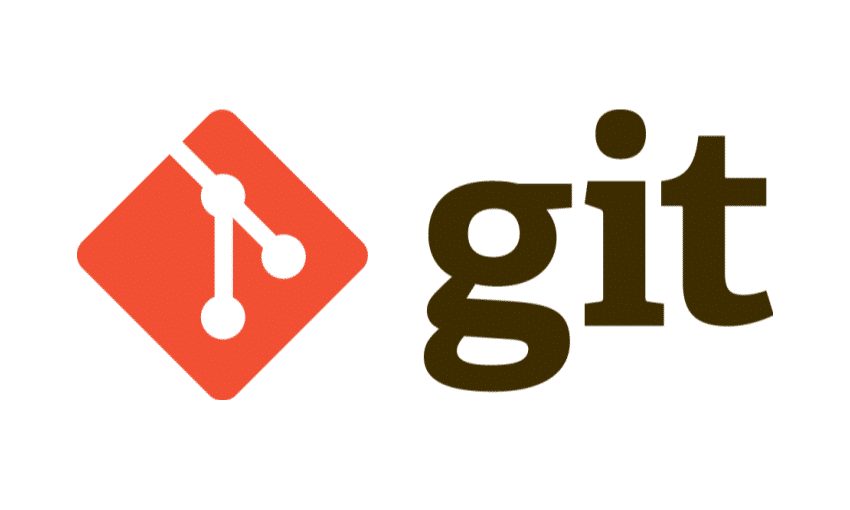

# site-portfolio
Esse é um projeto de **portfolio** com HTML CSS e Javascript

## Módulos

Entendendo o que é git, _Aprendendo_  sobre repositórios,
trabalhando com **Branches**

**Logo do Git** 

**URL Do gitHUB [GitHub](https://github.com/)

## Modulos
1. Começando com o Git
    1. o que é git
    2. instalando git na maquina
2. Aprendendo sobre Branches
3. Git Avançado

<li> lista nao ordenada
<li> lista nao ordenada
<li> lista nao ordenada